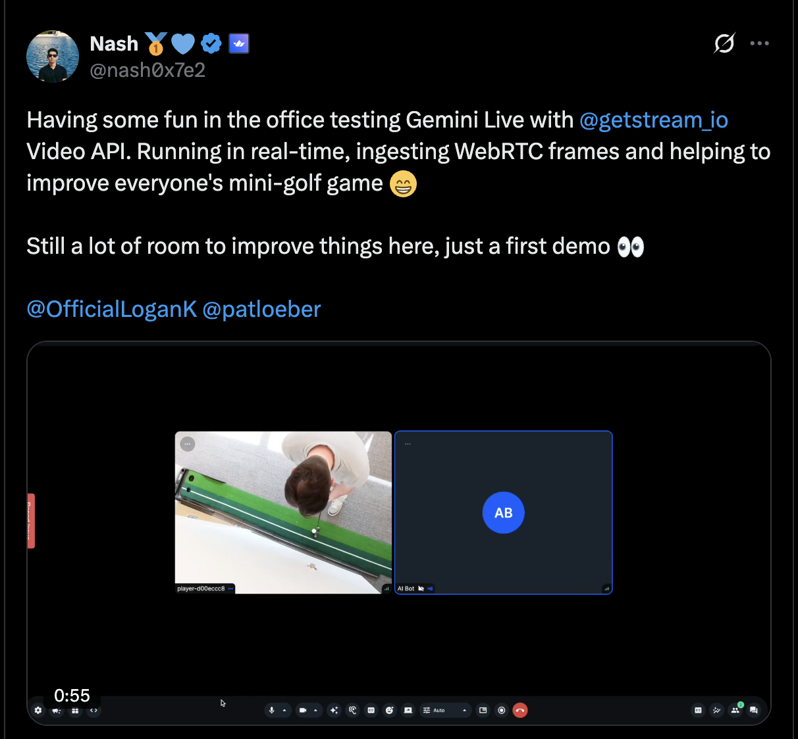

# Open Vision Agents by Stream

[](https://github.com/GetStream/Vision-Agents/actions)
[](http://badge.fury.io/py/vision-agents)

[](https://github.com/GetStream/Vision-Agents/blob/master/LICENSE)

[](https://youtu.be/Hpl5EcCpLw8)


Build Vision Agents quickly with any model or video provider.

-  **Video AI**: Built for real-time video AI. Combine Yolo, Roboflow and others with gemini/openai realtime
-  **Low Latency**: Join quickly (500ms) and low audio/video latency (30ms)
-  **Open**: Built by Stream, but use any video edge network that you like
-  **Native APIs**: Native SDK methods from OpenAI (create response), Gemini (generate) and Claude (create message). So you can always use the latest LLM capabilities.
-  **SDKs**: SDKs for React, Android, iOS, Flutter, React, React Native and Unity.

Created by Stream, uses [Stream's edge network](https://getstream.io/video/) for ultra-low latency.

## Examples

### Sports Coaching
[](https://x.com/nash0x7e2/status/1950341779745599769)

This example shows you how to build golf coaching AI with YOLO and OpenAI realtime.
Combining a fast object detection model (like YOLO) with a full realtime AI is useful for many different video AI use cases.
For example: Drone fire detection. Sports/video game coaching. Physical therapy. Workout coaching, Just dance style games etc.

```python
# partial example, full example: examples/02_golf_coach_example/golf_coach_example.py
agent = Agent(
    edge=getstream.Edge(),
    agent_user=agent_user,
    instructions="Read @golf_coach.md",
    llm=openai.Realtime(fps=10),
    #llm=gemini.Realtime(fps=1), # Careful with FPS can get expensive
    processors=[ultralytics.YOLOPoseProcessor(model_path="yolo11n-pose.pt")],
)
```

### Cluely style Invisible Assistant (coming soon)

Apps like Cluely offer realtime coaching via an invisible overlay. This example shows you how you can build your own invisible assistant.
It combines Gemini realtime (to watch your screen and audio), and doesn't broadcast audio (only text). This approach
is quite versatile and can be used for: Sales coaching, job interview cheating, physical world/ on the job coaching with glasses

Demo video

```python
agent = Agent(
    edge=StreamEdge(),  # low latency edge. clients for React, iOS, Android, RN, Flutter etc.
    agent_user=agent_user,  # the user object for the agent (name, image etc)
    instructions="You are silently helping the user pass this interview. See @interview_coach.md",
    # gemini realtime, no need to set tts, or sst (though that's also supported)
    llm=gemini.Realtime()
)
```

## Processors

Processors enable you to provide state and receive/publish video & audio. 
Many video AI use case require you to do things like

* Run a smaller AI model next to the LLM (like Yolo or roboflow)
* Make API calls to maintain relevant info/game state
* Modify audio/video, for instance avatars
* Capture audio/video

This is all handled by processors. 

## Docs

To get started with Vision Agents, check out our getting started guide at [VisionAgents.ai](https://visionagents.ai).

- Quickstart: [Building a Voice AI app](https://visionagents.ai/introduction/voice-agents)
- Quickstart: [Building a Video AI app](https://visionagents.ai/introduction/video-agents)
- Tutorial: [Building realtime sports coaching](https://github.com/GetStream/Vision-Agents/tree/main/examples/02_golf_coach_example)
- Tutorial: [Building a realtime meeting assistant](#)

## Development

See DEVELOPMENT.md

## Awesome Video AI

Our favorite people & projects to follow for vision AI

* https://x.com/demishassabis. CEO google deepmind, won a nobel prize
* https://x.com/OfficialLoganK. Product lead gemini, posts about robotics vision
* https://x.com/ultralytics. various fast vision AI models. Pose, detect objects, segment, classify etc.
* https://x.com/skalskip92. roboflow open source lead
* https://x.com/moondreamai. the tiny vision model that could
* https://x.com/kwindla. pipecat/daily
* https://x.com/juberti. head of realtime AI openai
* https://x.com/romainhuet head of developer experience openAI
* https://x.com/thorwebdev eleven labs
* https://x.com/mervenoyann huggingface, quite some posts about Video AI

## Inspiration

- Livekit Agents: Great syntax, Livekit only
- Pipecat: Flexible, but more verbose.
- OpenAI Agents: Focused on openAI only

## Open Platform
Reach out to nash@getstream.io, and we'll collaborate on getting you added
We'd like to add support for and are reaching out to:

* Mediasoup
* Janus
* Cloudflare
* Twilio
* AWS IVS
* Vonage
* And others.

## Roadmap

**0.1 - First release**
- Support for >10 out of the box [integrations](https://visionagents.ai/integrations/introduction-to-integrations)
- Support for video processors
- Native Stream Chat integration for memory
- Support for MCP and function calling for Gemini and OpenAI
- Support for realtime WebRTC video and voice with GPT Realtime

**Coming Soon**
- The Python WebRTC lib we use has some limitations. Investigating this.
- Hosting & production deploy example
- More built-in Yolo processors: Object detection, person detection, etc
- Roboflow support
- Computer use support
- AI avatar support. Tavus etc
- QWen3 vision support
- Buffered video capture support (enabling AI to capture video when something exciting happens)
- Moondream vision

